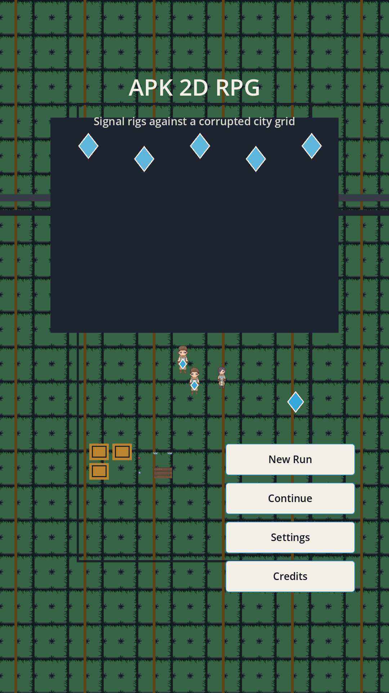
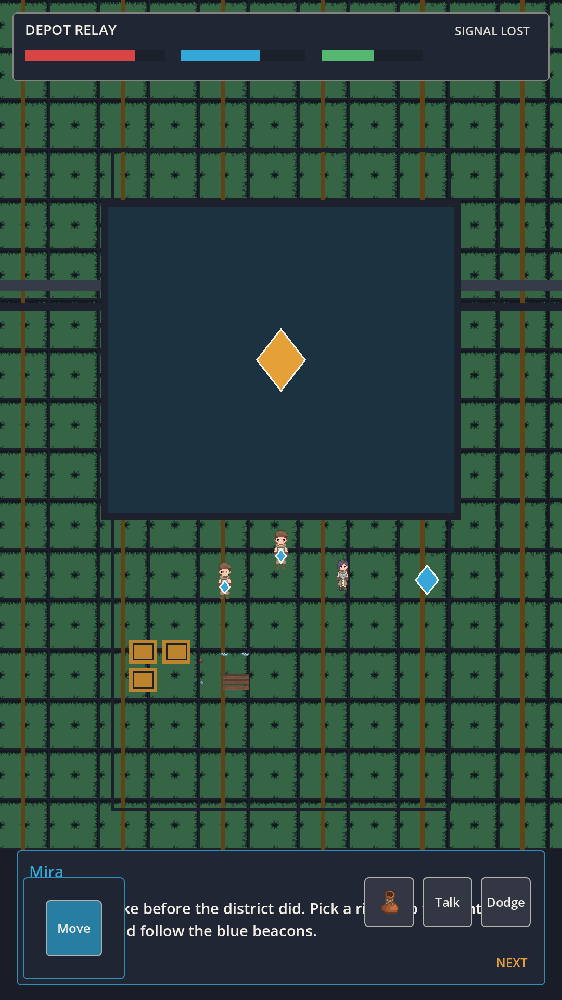
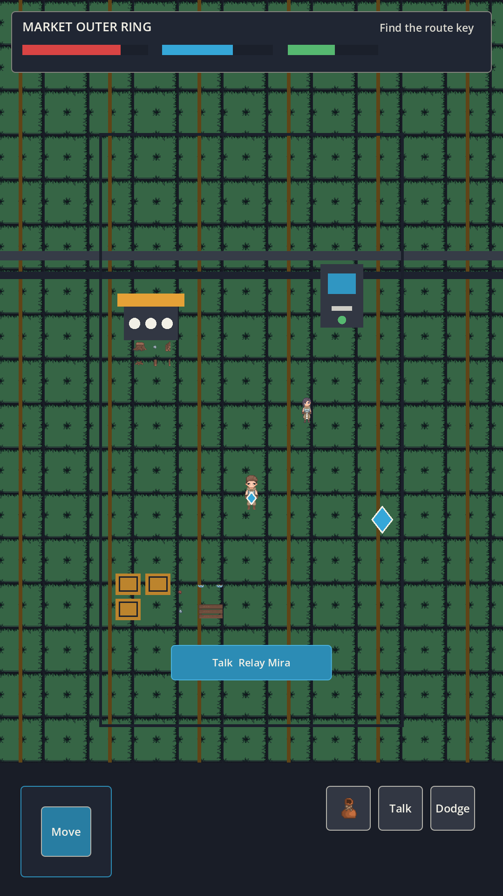
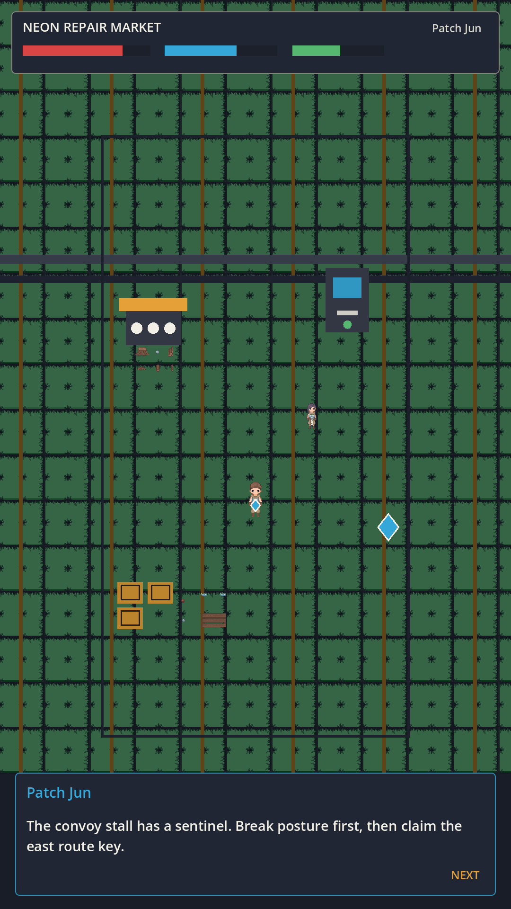
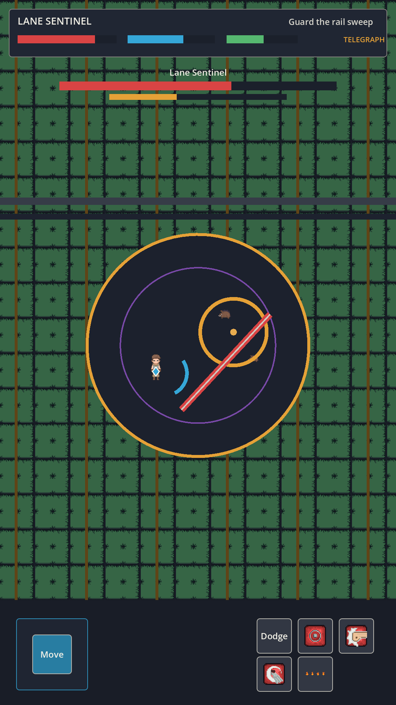
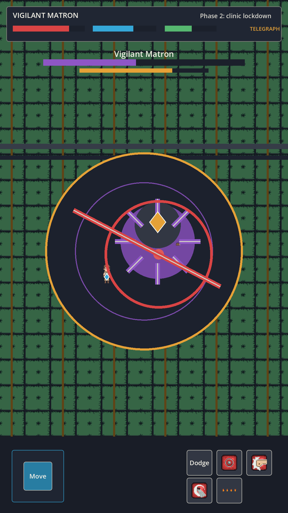
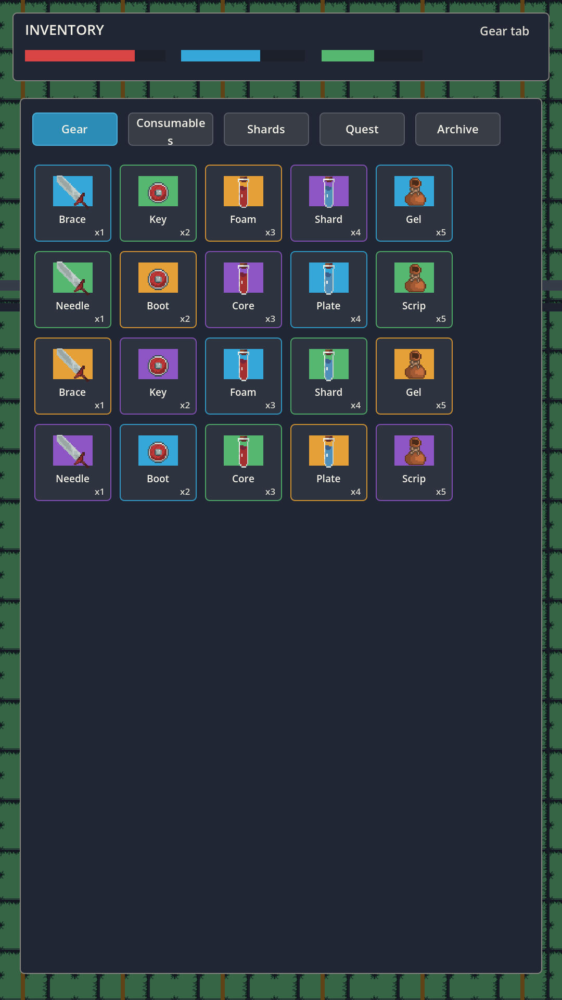
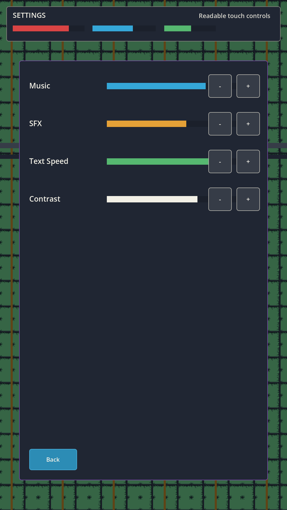

# APK 2D RPG

**Lazycodex 딸깍으로 만든 RPG게임**입니다. 2038년 AGI 로봇 도시를 배경으로 한 Godot 4.7 기반 2D 액션 RPG vertical slice이며, Android APK와 HTML5 빌드를 함께 검증했습니다.

## 게임 개요

- 제목: `APK 2D RPG`
- 세계관: 2038년 New Ilhwa. 공공 AGI `CIVIC MIND`가 시민 기억을 위험 요소로 분류하고, 저항 courier cell `Relay`가 기억 shard를 되찾는 이야기입니다.
- 장르: 세로형 2D top-down 액션 RPG
- 엔진: Godot `4.7.stable`
- Android package: `com.lazycodex.apk2drpg`
- 현재 범위: Chapter 1 vertical slice

## Andy 프롬프트 요약

- "2038년 AGI 로봇 시대에 살아가는 액션 RPG 게임"
- "인트로화면, 인트로영상, 게임시작하기, 저장하기, 종료하기가 있는 완성형"
- "캐릭터 스토리, 대화창, 기술, 레벨, 스탯, 적, 보스가 있어야 함"
- "2D RPG 레퍼런스를 보고 초보적인 화면이 아닌 게임다운 화면으로 만들 것"
- "실제 게임 화면 스크린샷과 Visual QA를 README와 GitHub Release에 포함"
- "APK로 빌드하고 GitHub Release로 public 발행"

## 실제 게임 화면

| Title | Intro |
| --- | --- |
|  |  |

| Exploration | Dialogue |
| --- | --- |
|  |  |

| Combat | Boss |
| --- | --- |
|  |  |

| Inventory | Settings |
| --- | --- |
|  |  |

## 플레이 요소

- 플레이어 rig 3종: Kinetic Courier, Signal Weaver, Anchor Mender
- 스킬 12종: dashcut, tether, brace, repair burst 등
- 적 8종 이상과 보스 2종
- 퀘스트 6개 이상, 아이템 20개 이상
- 저장/이어하기, 설정 저장, 손상된 저장 파일 복구
- 인트로, 타이틀, 크레딧, 설정, 인벤토리, 보스/승리 화면

## 실행 방법

### Android APK

1. GitHub Release `v0.1.0`에서 `apk-2d-rpg-debug.apk`를 다운로드합니다.
2. Android 기기에서 알 수 없는 앱 설치를 허용합니다.
3. APK를 설치하고 실행합니다.

이 APK는 debug keystore로 서명된 검증용 빌드입니다. Play Store 제출용 release keystore 서명은 별도 단계가 필요합니다.

### 로컬 Godot 실행

```bash
/home/ubuntuhong/dev/.local-tools/bin/godot --path /home/ubuntuhong/dev/apk-2d-rpg
```

### HTML5 빌드 확인

```bash
python3 -m http.server 4173 --bind 127.0.0.1 --directory web-export
```

브라우저에서 `http://127.0.0.1:4173`을 엽니다.

## QA 결과

- Full QA: `CONTENT_VALIDATION_OK`, `SAVE_ROUNDTRIP_OK`, `COMBAT_LOOP_OK`, `BOSS_CLEAR_OK`, `VERTICAL_SLICE_COMPLETE`
- Visual QA: `VISUAL_QA_PASS`
- Playthrough capture: title -> intro -> exploration -> combat -> boss -> save -> continue 프레임 캡처 완료
- APK verify: v2/v3 signature true, zipalign successful
- Package metadata: `com.lazycodex.apk2drpg`, version `0.1.0`, targetSdk `36`
- Device QA: 현재 연결된 Android device/emulator 없음. 설치 실기기 QA는 아직 주장하지 않습니다.

## 에셋과 라이선스

주요 runtime art는 Diamond Top Down Pixel Art Pack 기반입니다.

- Source: <https://dotmancer.itch.io/diamond-top-down-pixel-art>
- Author: Dotmancer
- License: CC0 1.0 Universal

자세한 출처와 재배포 가능 여부는 `ASSET_LEDGER.md`와 `CREDITS.md`에 기록했습니다.

## 개발/검증 명령

```bash
bash tools/run_full_qa.sh
ANDROID_HOME=/home/ubuntuhong/dev/.android-sdk ANDROID_SDK_ROOT=/home/ubuntuhong/dev/.android-sdk /home/ubuntuhong/dev/.local-tools/bin/godot --headless --path /home/ubuntuhong/dev/apk-2d-rpg --export-debug Android /home/ubuntuhong/dev/.omo/evidence/apk-2d-rpg/build/apk-2d-rpg-debug.apk
pnpm exec playwright test tests/web-release.spec.ts --project=chromium --reporter=line
```
